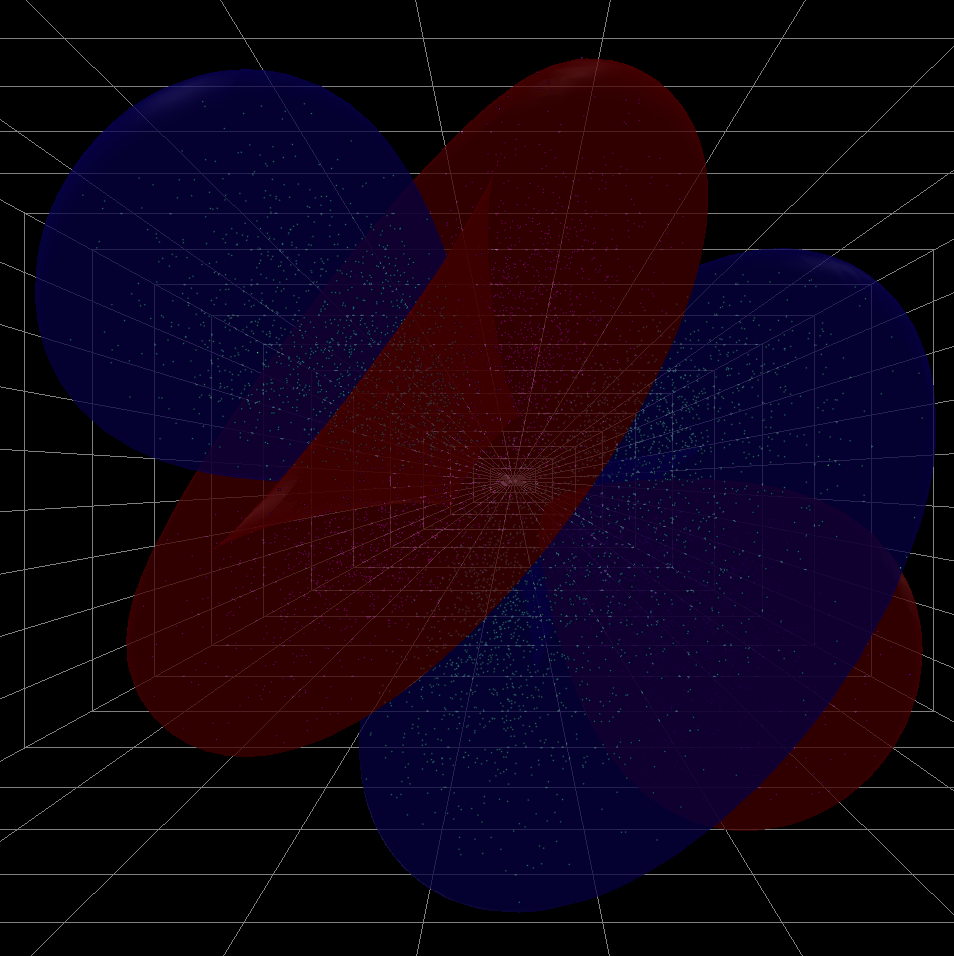
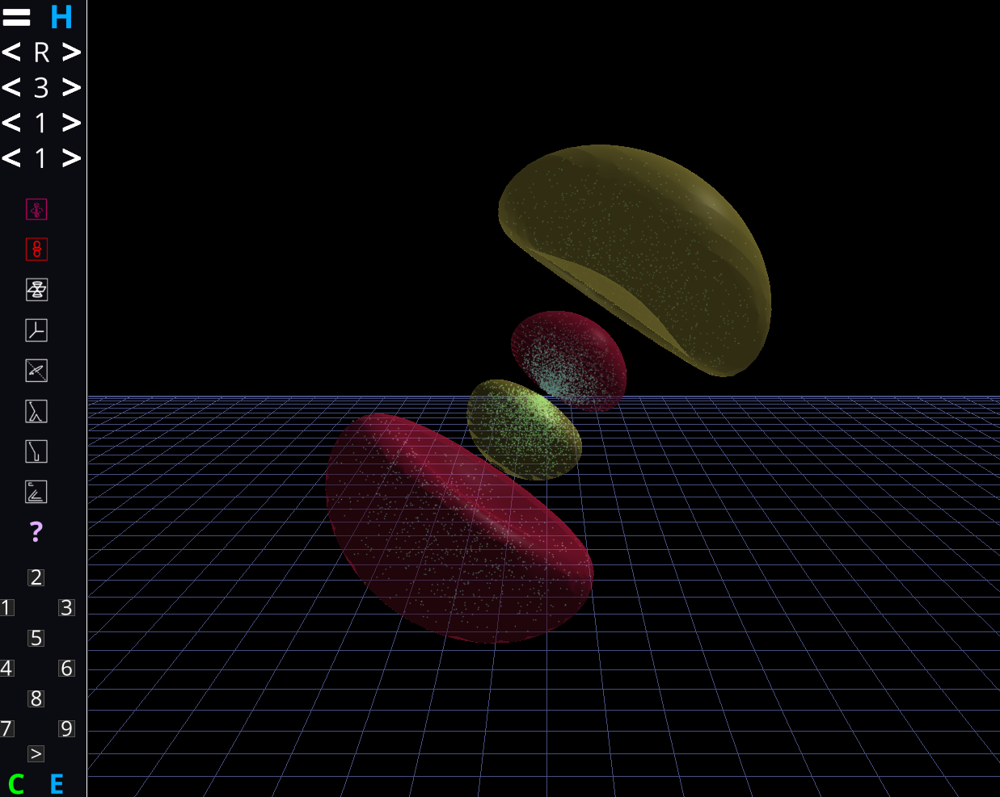
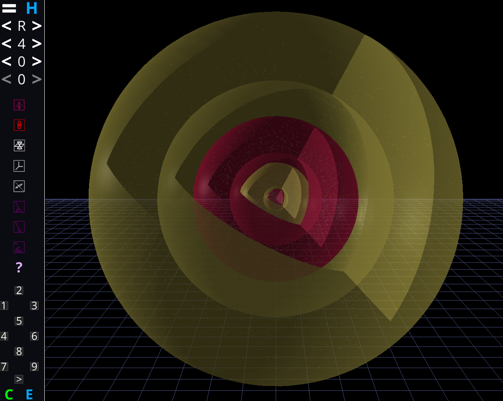
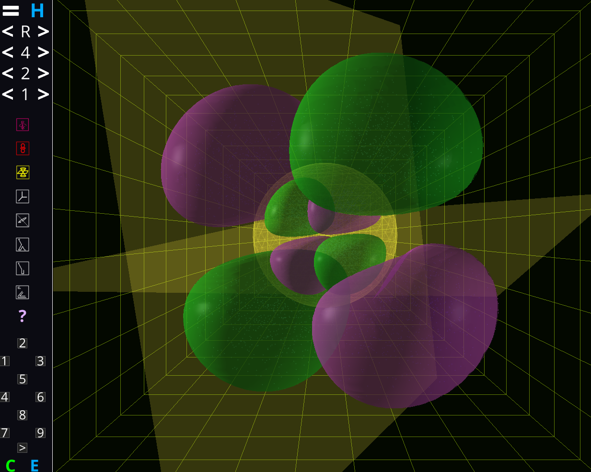
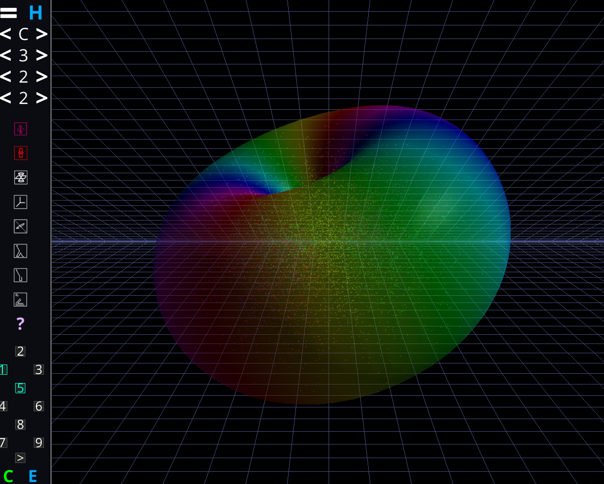

*If you want to download and run this program, click on "Releases"
to obtain the `.exe` file.*

# Electron Orbital Viewer

This program renders electron orbitals. You can display, real, imaginary, and complex orbitals, and choose between point cloud or isosurface representation, or use both. Orient them however you want in 3D, and apply nodes, slices, axes, and set them to rotate on their own. You can change the colors of the positive and negative portions of the orbitals. You can save presets and automatically switch between them with a slide show-like feature. You can also change the size of the ui between 3 different modes and use all of those functions with hotkeys instead, and you can choose the colors of the different background options. I sincerely hope you enjoy this electron orbital visualizer!

The program may be built using PyCharm. It has been validated to work under
Windows.

## License
This program is licensed under the MIT License. You are free to use, modify, and
redistribute this program, but you must attribute me and include the license
text in `LICENSE`.
